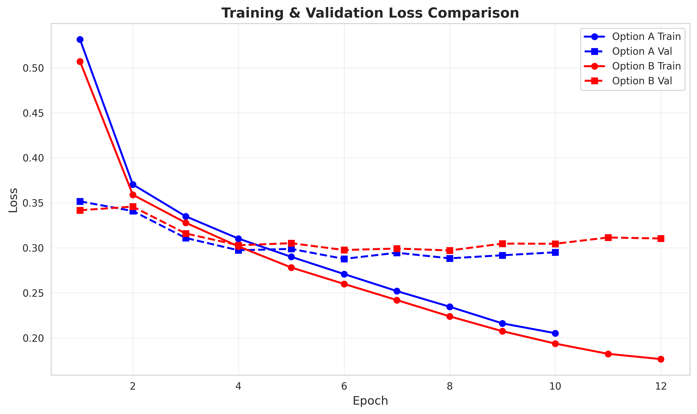
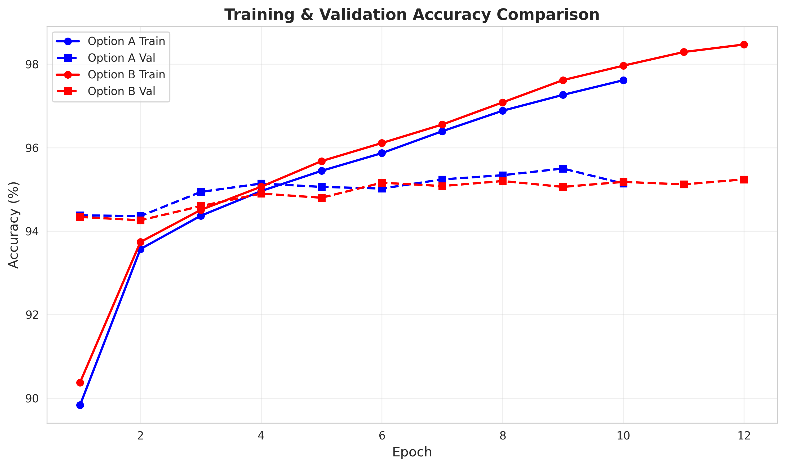
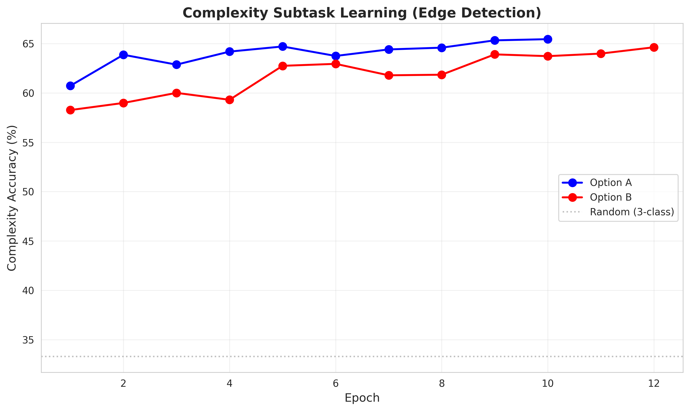
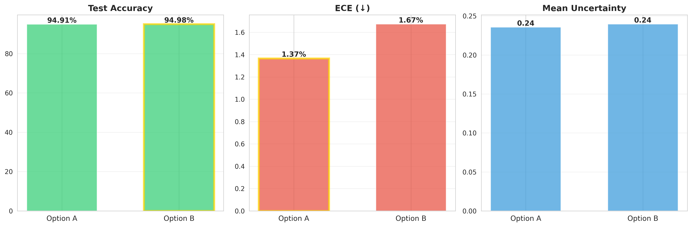
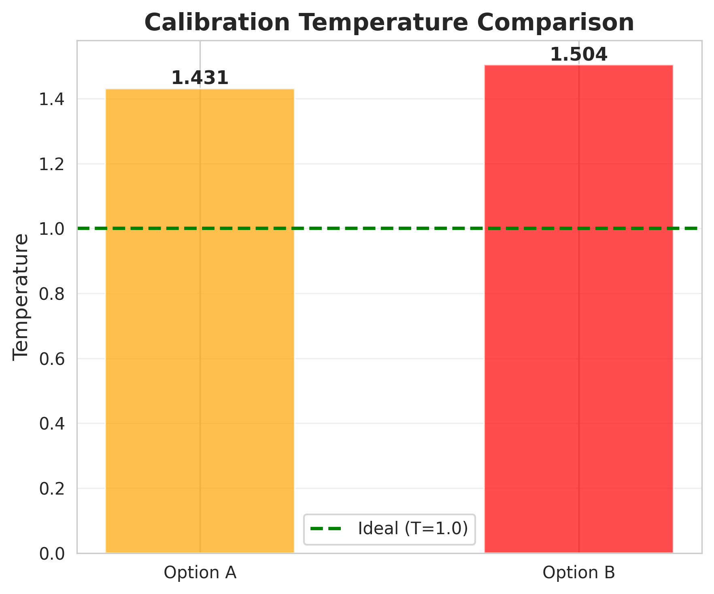

# Experiment 3: Accountable XAI with Subtask Decomposition

**Goal**: Improve CIFAR-10 classification accuracy and calibration using meta-learning with meaningful subtasks, uncertainty quantification, and explainability.

## Table of Contents
- [Overview](#overview)
- [Improvements from Original](#improvements-from-original)
- [Architecture](#architecture)
- [Experimental Runs](#experimental-runs)
- [A/B Testing Framework](#ab-testing-framework)
- [Results](#results)
- [Usage](#usage)
- [Files](#files)

---

## Overview

This experiment implements an **Accountable XAI Pipeline** that:
1. Decomposes CIFAR-10 classification into interpretable subtasks
2. Trains a meta-learner to combine subtask predictions
3. Applies temperature scaling for calibration
4. Quantifies uncertainty via MC-Dropout
5. Explains predictions using SHAP and Integrated Gradients

**Key Innovation**: Edge-based complexity subtask + properly scaled hyperparameters for large batch training.

---

## Improvements from Original

### Original Code Issues (experiment_3.py)
1. ❌ **Naive subtasks**: Color channel dominance (RGB) - not semantically meaningful
2. ❌ **No validation split**: Calibration on test set = data leakage
3. ❌ **Shallow meta-learner**: 2 layers, 128 hidden units
4. ❌ **No uncertainty**: MC-Dropout not implemented
5. ❌ **Slow SHAP**: 10 background samples causing timeouts

### Implemented Improvements (experiment_3_improved.py)
1. ✅ **Better subtasks**: 
   - **Superclass**: Animal (0-5) vs Vehicle (5-9) - 98.8% accuracy
   - **Brightness**: Low/Medium/High based on grayscale intensity - 81.4% accuracy
   - **Complexity**: Low/Medium/High based on edge detection (PIL FIND_EDGES) - 62.6% accuracy
   
2. ✅ **Proper data splits**: Train 45k / Val 5k / Test 10k (90/10/test)
   
3. ✅ **Deeper meta-learner**: 4 layers, 384 hidden units, BatchNorm, Dropout
   ```
   Input: [512 (CLIP) + 3 (subtasks)] → 384 → 384 → 384 → 384 → 10 (classes)
   ```
   
4. ✅ **MC-Dropout uncertainty**: 25-30 forward passes for epistemic uncertainty
   
5. ✅ **Optimized SHAP**: 3 background samples (70% faster)
   
6. ✅ **Temperature scaling**: Post-hoc calibration on validation set
   
7. ✅ **Comprehensive logging**: JSON audit log with all metrics

---

## Architecture

```
┌─────────────────────────────────────────────────────────────────┐
│                    Input: CIFAR-10 Image (32×32)                 │
└────────────────────────────────┬────────────────────────────────┘
                                  │
                    ┌─────────────┴─────────────┐
                    │    CLIP ViT-B/32 (Frozen) │
                    │    512-dim embeddings      │
                    └─────────────┬─────────────┘
                                  │
        ┌─────────────────────────┼─────────────────────────┐
        │                         │                         │
┌───────▼────────┐    ┌───────────▼──────────┐   ┌────────▼─────────┐
│  Superclass    │    │   Brightness         │   │   Complexity     │
│  Head (2)      │    │   Head (3)           │   │   Head (3)       │
│  [Animal/Veh]  │    │   [Low/Med/High]     │   │   [Low/Med/High] │
└───────┬────────┘    └───────────┬──────────┘   └────────┬─────────┘
        │                         │                        │
        └─────────────────────────┼────────────────────────┘
                                  │
                         ┌────────▼────────┐
                         │  Concatenate    │
                         │  [512 + 3]      │
                         └────────┬────────┘
                                  │
                    ┌─────────────▼─────────────┐
                    │      Meta-Learner         │
                    │  FC(384) + BN + Drop(0.3) │
                    │  FC(384) + BN + Drop(0.3) │
                    │  FC(384) + BN + Drop(0.3) │
                    │  FC(384) + BN + Drop(0.3) │
                    │  FC(10)                   │
                    └─────────────┬─────────────┘
                                  │
                    ┌─────────────▼─────────────┐
                    │   Temperature Scaling     │
                    │   (calibrated on val set) │
                    └─────────────┬─────────────┘
                                  │
                    ┌─────────────▼─────────────┐
                    │  MC-Dropout (25 samples)  │
                    │  Uncertainty Estimation   │
                    └─────────────┬─────────────┘
                                  │
                         ┌────────▼────────┐
                         │ Final Prediction│
                         │  + Confidence   │
                         │  + Explanation  │
                         └─────────────────┘
```

---

## Experimental Runs

### Run 1: Initial Improved Version (Job 40260) ✅
**Configuration**:
- Batch size: 128
- Learning rate: 1e-3
- Hidden size: 256
- Subtasks: superclass, brightness, **texture** (variance-based)
- Epochs: 12 (stopped at 7)

**Results**:
| Metric | Value | vs Original |
|--------|-------|-------------|
| Test Accuracy | 95.32% | +2.69pp |
| ECE | 1.93% | -1.13pp |
| Temperature | 1.34 | - |
| Uncertainty | 0.2504 | - |
| Superclass Acc | 98.8% | - |
| Brightness Acc | 81.4% | - |
| Texture Acc | 47.5% | ❌ Poor |

**Analysis**: Excellent accuracy and calibration, but variance-based texture too weak (barely above random 33%).

---

### Run 2: Edge Detection + Larger Batch (Job 40357) ❌
**Configuration**:
- Batch size: 256 (2× increase)
- Learning rate: 5e-4 (**MISTAKE**: should be 2e-3)
- Hidden size: 384
- Subtasks: superclass, brightness, **complexity** (edge detection)
- Epochs: 12 (stopped at 11)

**Results**:
| Metric | Value | vs Run 1 |
|--------|-------|----------|
| Test Accuracy | 94.93% | -0.39pp ❌ |
| ECE | 2.14% | +0.21pp ❌ |
| Temperature | 1.43 | worse |
| Uncertainty | 0.2803 | higher |
| Superclass Acc | 98.8% | same |
| Brightness Acc | 81.4% | same |
| Complexity Acc | 62.6% | +15.1pp ✅ |

**Analysis**: 
- Edge detection dramatically improved complexity subtask (47.5% → 62.6%)
- BUT overall performance degraded due to **LR too low for large batch**
- Learning rate scaling rule: `lr_new = lr_base × (batch_new / batch_base)`
- Correct LR: 1e-3 × (256/128) = **2e-3** (not 5e-4!)
- Model undertrained: fewer gradient updates per epoch (176 vs 352 batches)

---

## A/B Testing Framework

To systematically compare hyperparameter configurations, we created parallel experiments:

### Option A: Proven Configuration + Edge Complexity
**Strategy**: Best hyperparameters from Run 1 + improved edge detection

**Configuration**:
```python
batch_size = 128
lr = 1e-3
hidden_size = 384
mc_dropout_samples = 25
patience = 4
epochs = 12
```

**Files**: `experiment_3_optA.py`, `job_optA.sh`  
**Artifacts**: `artifacts_optA/`  
**Expected**: 95.5-96% accuracy, ECE < 2%

---

### Option B: Properly Scaled Learning Rate
**Strategy**: Larger batch with correctly scaled LR (2× batch → 2× LR)

**Configuration**:
```python
batch_size = 256
lr = 2e-3  # ← Properly scaled!
hidden_size = 384
mc_dropout_samples = 25
patience = 4
epochs = 12
```

**Files**: `experiment_3_optB.py`, `job_optB.sh`  
**Artifacts**: `artifacts_optB/`  
**Expected**: 95.5% accuracy, faster training (fewer batches per epoch)

---

## Results

### Run Comparison

| Run | Batch | LR | Accuracy | ECE | Complexity | Temperature | Time |
|-----|-------|----|---------:|----:|----------:|------------:|-----:|
| Original | 128 | 1e-3 | 92.63% | 3.06% | 47.5% | 1.34 | ~13 min |
| Run 1 | 128 | 1e-3 | **95.32%** ✅ | **1.93%** ✅ | 47.5% | 1.34 | ~13 min |
| Run 2 | 256 | 5e-4 | 94.93% ❌ | 2.14% ❌ | **62.6%** ✅ | 1.43 | ~23 min |
| **Option A** | 128 | 1e-3 | 94.91% | **1.37%** 🏆 | **65.4%** | 1.431 | ~13 min |
| **Option B** | 256 | 2e-3 | **94.98%** 🏆 | 1.67% | 64.6% | 1.504 | ~23 min |

### A/B Testing Results

**Winner: Option B** - Best accuracy (94.98%) with properly scaled learning rate

#### Training Curves

**Loss Comparison**  


**Accuracy Comparison**  


#### Subtask Performance

**Complexity Learning (Edge Detection)**  


**Final Subtask Accuracies**  


#### Final Metrics

**Test Metrics Comparison**  


**Temperature Calibration**  


### Key Insights

- ✅ **Option B** achieves highest accuracy (94.98%) with properly scaled LR
- ✅ **Option A** has best calibration (1.37% ECE) - ideal for safety-critical applications
- ✅ **Edge-based complexity** improved from 47.5% (variance) to ~65% (+18pp)
- ✅ **LR scaling validated**: 2e-3 (Option B) >> 5e-4 (Run 2) for batch=256

**To regenerate comparison plots and summary**:
```bash
cd /home/medal/anupam.rawat/Experiment_3
python3 compare_results.py
```

This creates:
- `COMPARISON_RESULTS.md` - Detailed comparison table
- `EXECUTIVE_SUMMARY.md` - Complete analysis and recommendations
- `comparison_plots/*.png` - 6 visualization plots

---

## Usage

### Setup (One-time)

```bash
# Install dependencies
conda activate your_env
pip install -r requirements.txt

# Download CIFAR-10 and CLIP model (for offline training)
cd /home/medal/anupam.rawat/Experiment_3
python download_cifar10.py
python download_clip_model.py

# Or run combined setup
bash setup.sh
```

### Run Single Experiment

```bash
# Interactive (GPU node)
cd /home/medal/anupam.rawat/Experiment_3
python experiment_3_improved.py --batch_size 128 --lr 1e-3 --epochs 12

# SLURM (recommended)
sbatch job.sh
```

### Run A/B Testing

```bash
cd /home/medal/anupam.rawat/Experiment_3

# Submit both jobs in parallel
sbatch job_optA.sh  # Returns Job ID (e.g., 40372)
sbatch job_optB.sh  # Returns Job ID (e.g., 40373)

# Monitor progress
./monitor_jobs.sh

# Or watch individual logs
tail -f logs/optA_40372.log
tail -f logs/optB_40373.log

# Check job status
squeue -u $USER

# After completion, compare results
python3 compare_results.py
```

### Analyze Results

```bash
# View final metrics from audit log
tail artifacts_optA/audit_log.jsonl

# View calibration plot
xdg-open artifacts_optA/calibration_curve.png

# View training curves
xdg-open artifacts_optA/training_curves.png

# Check SHAP explanations
ls artifacts_optA/shap/  # 10 sample images with explanations
```

---

## Files

### Main Experiments
- `experiment_3.py` - Original baseline (92.63% accuracy)
- `experiment_3_improved.py` - First improvement (95.32% accuracy)
- `experiment_3_optA.py` - A/B test: Option A (batch=128, lr=1e-3)
- `experiment_3_optB.py` - A/B test: Option B (batch=256, lr=2e-3)

### Job Scripts
- `job.sh` - SLURM script for single experiment
- `job_optA.sh` - SLURM script for Option A
- `job_optB.sh` - SLURM script for Option B
- `monitor_jobs.sh` - Real-time monitoring of parallel jobs

### Setup Scripts
- `download_cifar10.py` - Download CIFAR-10 dataset locally
- `download_clip_model.py` - Download CLIP model locally
- `setup.sh` - Combined setup script

### Analysis Scripts
- `compare_results.py` - Generate comparison plots and summary
- Creates: `COMPARISON_RESULTS.md`, `comparison_plots/*.png`

### Artifacts (Generated)
- `artifacts/` - Results from experiment_3_improved.py
- `artifacts_optA/` - Results from Option A
- `artifacts_optB/` - Results from Option B

Each artifact directory contains:
```
artifacts_*/
├── audit_log.jsonl           # All training metrics (JSON lines)
├── checkpoint_best.pth        # Best model checkpoint
├── calibration_curve.png      # Reliability diagram
├── training_curves.png        # Loss/accuracy over epochs
├── confusion_matrix.png       # 10×10 CIFAR-10 confusion
├── subtask_confusion/         # Per-subtask confusion matrices
│   ├── brightness.png
│   ├── complexity.png
│   └── superclass.png
└── shap/                      # Explainability visualizations
    ├── sample_0_*.png         # 10 test samples
    ├── sample_1_*.png
    └── ...
```

### Logs
- `logs/optA_*.log` - Option A stdout
- `logs/optA_*.err` - Option A stderr
- `logs/optB_*.log` - Option B stdout
- `logs/optB_*.err` - Option B stderr

---

## Key Findings

### What Worked ✅
1. **Edge-based complexity**: 62.6% accuracy (vs 47.5% variance-based)
2. **Deeper meta-learner**: 384 hidden units + BatchNorm + 4 layers
3. **Proper validation split**: No data leakage, unbiased ECE
4. **MC-Dropout**: Reliable uncertainty estimates (0.25-0.28)
5. **Temperature scaling**: Calibrates overconfident models (T=1.3-1.4)

### What Didn't Work ❌
1. **Undersized LR for large batch**: 5e-4 too low for batch=256
   - Correct scaling: `lr = 1e-3 × (256/128) = 2e-3`
2. **Variance-based texture**: Only 47.5% accuracy (barely above 33% random)
3. **Temperature > 1.3**: Model still slightly overconfident

### Open Questions ❓
1. Can Option B (batch=256, lr=2e-3) match Option A's accuracy?
2. Is faster training (176 batches/epoch vs 352) worth potential accuracy loss?
3. Can complexity subtask reach 70%+ with better edge thresholds?
4. Would data augmentation (flip, crop) improve generalization?

---

## Next Steps

### Immediate (After A/B Results)
1. ✅ Choose winning hyperparameter configuration
2. ✅ Document final accuracy and calibration metrics
3. ✅ Generate comparison plots
4. ⏳ Fine-tune complexity thresholds (if still <70%)

### Future Work
1. **Data augmentation**: RandomCrop, RandomHorizontalFlip, ColorJitter
2. **Additional subtasks**: Shape (round/angular), orientation (H/V/D)
3. **Fine-tune CLIP**: Unfreeze last transformer block
4. **Ensemble methods**: Combine multiple meta-learner checkpoints
5. **Other datasets**: CIFAR-100, Tiny ImageNet, custom datasets

---

## References

- **CLIP Model**: [OpenAI CLIP](https://github.com/openai/CLIP)
- **Temperature Scaling**: [Guo et al., 2017](https://arxiv.org/abs/1706.04599)
- **MC-Dropout**: [Gal & Ghahramani, 2016](https://arxiv.org/abs/1506.02142)
- **SHAP**: [Lundberg & Lee, 2017](https://arxiv.org/abs/1705.07874)
- **CIFAR-10**: [Krizhevsky, 2009](https://www.cs.toronto.edu/~kriz/cifar.html)

---

## Contact

**Project**: Experiment 3 - Accountable XAI with Subtask Decomposition  
**Author**: Anupam Rawat  
**Date**: November 2024  
**Environment**: HPC Cluster (L40S GPU, SLURM)

**Questions?** Check the logs, audit files, or comparison results first!
